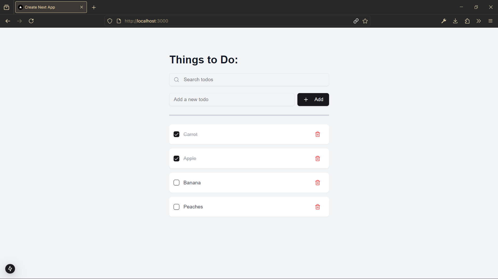

# To-Do App

Techstack Used: Nextjs , React, Tailwind Css & TypeScript

To See how the app works , **Click the Image** Below to See the full demo below:

[](https://www.youtube.com/watch?v=6R5w5XYnWVs)

## 🚀 Getting Started

Follow the steps below to set up and run the app locally on your machine.

### Prerequisites
- Ensure you have **Node.js** and **npm** installed on your system.

### Step 1: Clone the Repository

Run the following command in your terminal to clone the repository:
```bash  
git clone <RepositoryName>  
```  

### Step 2: Install Dependencies

Navigate to the project folder and install all required dependencies:
```bash  
cd <RepositoryName>  
npm install  
```  

### Step 3: Run the Development Server

Start the development server using:
```bash  
npm run dev  
```  

### Step 4: Open in Browser

Once the server is running, open your browser and visit:
```
http://localhost:3000  
```  
